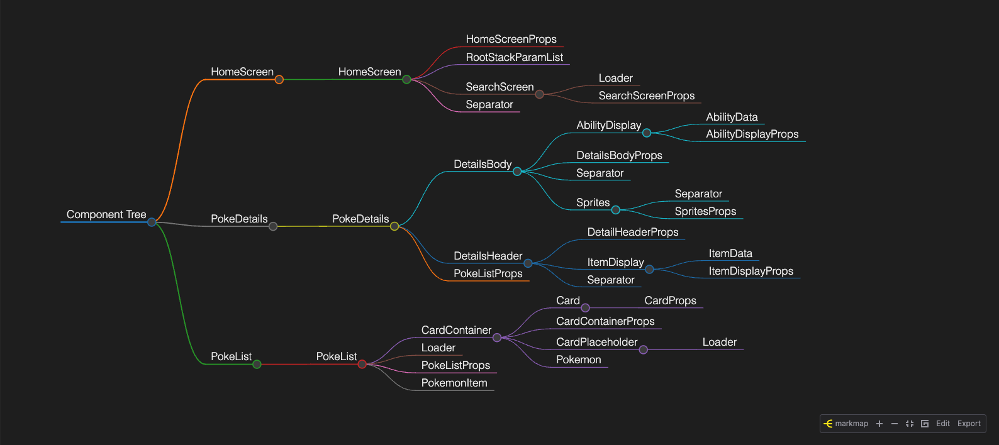

# Component Tree Generator

This Python script analyzes a React project and generates a **Markdown-based component tree**. The output is a `.mm.md` file that can be used with **Markmap** to visualize the component structure.

## Features

- **Scans ****\`\`**** files** to detect component relationships.
- **Generates a hierarchical Markdown file** (`componentsTree.mm.md`) for visualization.
- **Allows ignoring external libraries** so only project components are shown.
- **Supports limiting analysis to specific directories** with `--in` flag.
- **Option to only include project-defined components** with `--project-only` flag.

## Installation

No dependencies required. Ensure you have **Python 3.7+** installed.

## Usage

Run the script from your terminal:

```sh
python generate_component_tree.py [project_directory] [options]
```

### Options

| Flag             | Description                                                                             |
| ---------------- | --------------------------------------------------------------------------------------- |
| `directory`      | (Optional) The root directory of your React project (defaults to current directory `.`) |
| `--ignore-libs`  | List of external libraries to ignore components from (e.g., `react-bootstrap`, `antd`)  |
| `--project-only` | If set, only includes components defined within the project (ignores external ones)     |
| `--in`           | List of specific directories to analyze (e.g., `--in ./src/components ./src/pages`)     |

### Example Usage

#### Scan the entire project

```sh
python generate_component_tree.py ./my-react-app
```

#### Ignore external libraries (e.g., `react-bootstrap` and `antd`)

```sh
python generate_component_tree.py ./my-react-app --ignore-libs react-bootstrap antd
```

#### Only include project-defined components

```sh
python generate_component_tree.py ./my-react-app --project-only
```

#### Limit analysis to specific directories

```sh
python generate_component_tree.py ./my-react-app --in ./src/components ./src/pages
```

## Output Format

The script generates a file `componentsTree.mm.md` with the following structure:

```md
---
title: Component Tree
markmap:
  colorFreezeLevel: 4
---

## Layout
- Navbar
- Home
  - SlideShowA
  - SlideShowB
- PersonalDetails
  - CardContainerA
    - Card
  - CardContainerB
    - Card
```

## Visualizing with Markmap

You can visualize the generated tree using **Markmap**:

1. Install Markmap globally (if not already installed):

   ```sh
   npm install -g markmap-cli
   ```

2. Open the file in a Markmap viewer:

   ```sh
   markmap componentsTree.mm.md
   ```

## License

This project is open-source and available under the **MIT License**.

## Example

Used on a small personal [Pokedex](https://github.com/paradoxial-composition/pokedex-app) react-native project:

  ```bash
  python3 react-component-tree-generator.py ../pokedex-app --in ../pokedex-app/src/components ../pokedex-app/src/screens --ignore-libs react-native
  ```

### Result

```bash
---
title: Component Tree
markmap:
  colorFreezeLevel: 4
---

## HomeScreen

- HomeScreen
  - HomeScreenProps
  - RootStackParamList
  - SearchScreen
    - Loader
    - SearchScreenProps
  - Separator

## PokeDetails

- PokeDetails
  - DetailsBody
    - AbilityDisplay
      - AbilityData
      - AbilityDisplayProps
    - DetailsBodyProps
    - Separator
    - Sprites
      - Separator
      - SpritesProps
  - DetailsHeader
    - DetailHeaderProps
    - ItemDisplay
      - ItemData
      - ItemDisplayProps
    - Separator
  - PokeListProps

## PokeList

- PokeList
  - CardContainer
    - Card
      - CardProps
    - CardContainerProps
    - CardPlaceholder
      - Loader
    - Pokemon
  - Loader
  - PokeListProps
  - PokemonItem
```


